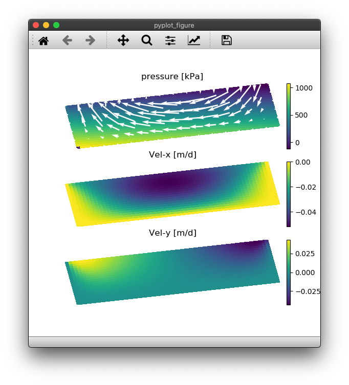

# PseudoTransientExamples
Concise and (multi-GPU)-ready iterative PDE solvers for Earth-science applications and beyond.


## Description
This repository contains various Pseudo-Transient (PT) routines with application to Earth-sciences (glaciology and subsurface processes). These routines exemplify the implementation of a fast and concise (60 lines of code) iterative solving strategy referred to as Pseudo-Transient. The core of the Pseudo-Transient approach relies in using physics-motivated transient terms within differential equations in order to iteratively converge to an accurate solution.


## Content
* [Script list](#script-list)
* [Usage](#usage)
* [Output](#output)


## Script list
The [/scripts](/scripts/) folder contains various PT routines. Currently, the routines are
- viscous_gl2D.jl
- viscous_gl2D_gpu.jl
- viscous_gl2D_nondim.jl
- viscous_gl2D_nondim_gpu.jl

The keywords in the code naming stand for:
- viscous_gl2D: 2D viscous (full) Stokes with linear shear viscosity (scalar)
- gpu: Nvidia GPU ready routines using the [CUDA.jl] package
- nondim: non-dimensional version of the code, using natural scaling


## Usage
If not stated otherwise, all the routines are written in Julia and can be executed from the REPL. Output is produced using `PyPlot.jl` requiring a valid and on `PATH` python (+ matplotlib) install.

Example running the `viscous_gl2D_nondim.jl` routine.

1. Launch Julia
```sh
% julia --project
```
2. Activate and instantiate the environment
```julia-repl
               _
   _       _ _(_)_     |  Documentation: https://docs.julialang.org
  (_)     | (_) (_)    |
   _ _   _| |_  __ _   |  Type "?" for help, "]?" for Pkg help.
  | | | | | | |/ _` |  |
  | | |_| | | | (_| |  |  Version 1.5.0 (2020-08-01)
 _/ |\__'_|_|_|\__'_|  |  Official https://julialang.org/ release
|__/                   |

julia> 

(PseudoTransientExamples) pkg> instantiate

(PseudoTransientExamples) pkg> st
Status `~/Documents/git/github/PseudoTransientExamples/Project.toml`
  [d330b81b] PyPlot v2.9.0
  [10745b16] Statistics

(PseudoTransientExamples) pkg> 

julia> 
```
3. Run the script
```julia-repl
julia> include("viscous_gl2D_nondim.jl")
error = 0.007844763087162187
error = 0.0035814871757943543
error = 0.0005235773871451197
error = 6.932325914314143e-5
error = 2.3742721434622532e-5
error = 9.103473750402527e-7
error = 7.903400522027475e-7
error = 7.196251086591826e-8
error = 1.9440634300592754e-8
error = 4.161439365592243e-9
error = 2.54854535939787e-10
error = 1.6094254786093418e-10

julia> 
```

## Output
The output of running the `viscous_gl2D_nondim.jl` script is following



